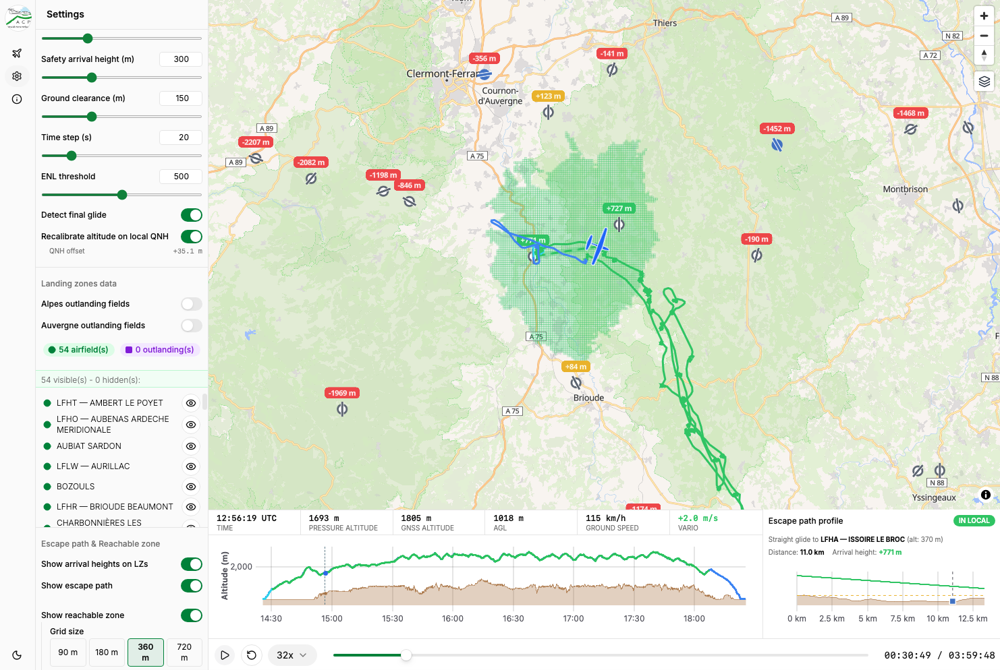

# Local Check

[](https://opensource.org/licenses/MIT)
[](<>)
[](http://makeapullrequest.com)

A specialized safety and post-flight analysis tool for glider pilots and soaring clubs. **Local Check** verifies whether a pilot remained within safe gliding distance (local range) of an airfield or a designated Landing Zone throughout their entire flight.



## 🎯 Core Objective

Safety is paramount in soaring. This tool processes `.IGC` flight logs to automatically audit track logs against predefined landing options (airfields and verified Landing Zones suitable for outlandings).

It helps flight instructors and pilots answer critical safety questions:

- Did the pilot stay within safe gliding range ($L/D$) of a suitable landing spot at all times?
- Were safety margins (minimum arrival altitudes) respected before leaving a thermal or gliding between zones?
- Did any part of the flight enter an "out-of-glide" red zone?

## 🚧 Project Status

### ✨ Implemented features

- **IGC Parsing:** Client-side parsing of standard IGC flight records, off the main thread via a Web Worker.
- **Interactive Replay:** Play/pause, step forward/backward, reset, adjustable playback speed (1×–16×), and timeline scrubbing, with keyboard shortcuts (Space, ←/→, Home).
- **Map View:** Flight track rendered on MapLibre GL, with a live position marker synced to replay time. Five basemap styles are switchable at runtime: **OpenStreetMap**, **Liberty**, **Positron** and **Dark** (all three via [OpenFreeMap](https://openfreemap.org)), plus **Satellite (Esri World Imagery)**.
- **Barogram:** Interactive altitude-over-time chart with a replay-synced cursor and click/hover-to-seek.
- **Telemetry & Flight Summary Panels:** Live time, position, altitude (pressure/GNSS), ground speed, and vario, plus overall flight stats (date, pilot, glider, duration, min/max altitude, max speed, total distance).
- **Derived Metrics:** Ground speed, vario, and cumulative distance computed from raw IGC fixes.
- **Landing Zone import (`.cup`):** SeeYou-format waypoint files parsed client-side; airfield vs outlanding, difficulty tags (`{A}` / `{F}` / `{M}` / `{D}` / `{TD}`), 250 m de-duplication.
- **Terrain elevation:** DEM grid prefetched around the flight bounding box, with bilinear sampling for AGL and glide computations. Two backends are supported and selectable via env var:
  - **Microsoft Planetary Computer** *(default)* — no API key required; serves **[Copernicus DEM GLO-30](https://planetarycomputer.microsoft.com/dataset/cop-dem-glo-30)** (WorldDEM DSM, ~30 m, EGM2008 geoid) via STAC + Cloud-Optimised GeoTIFF byte-range reads.
  - **OpenTopography** — single-GeoTIFF request; requires `VITE_OPENTOPOGRAPHY_API_KEY`. Choice of DEM via `VITE_ELEVATION_DEMTYPE`: `EU_DTM` (Copernicus EU-DEM v1.1, ~25 m, Europe), `SRTMGL1` / `SRTMGL3` (NASA SRTM, ~30 / 90 m, global ±60°), `COP30` / `COP90` (Copernicus GLO-30 / 90, global).
  A **DSM** (Digital Surface Model — top-of-canopy) rather than a DTM (bare-earth) is used on purpose: for landability analysis the safety-relevant height is the top of what stands on the ground (canopy, buildings), not the theoretical ground level a few meters below.
- **In-local / marginal / out-of-local classification:** One shared rule across all surfaces — for each fix, pick the LZ with the highest projected arrival above ground, then colour by `arrival > safety height` (green) / `arrival > 0` (yellow) / `arrival ≤ 0` (red).
- **Coloured track & barogram:** Track segments and altitude line coloured per phase (initial-climb, motor, final-glide) and status. Legend surfaces every colour.
- **Out-of-local statistics:** Time / % out-of-local, mean & max missing height, first out-of-local time (click-to-seek).
- **Configurable parameters:** Working L/D, safety arrival height, time step, ENL threshold — all persisted via `localStorage`. (Ground clearance is exposed but informational only; it does not gate status.)
- **Escape path:** From the current replay position to the LZ with the highest arrival height above ground. Dashed polyline on the map (green/yellow/red per shared status rule). Computed as a **straight line** to the target LZ for now — terrain-collision detection along the path is not performed yet; the escape-path profile chart lets the pilot visually check whether the glide clips the ground.
- **Escape-path profile chart:** Compact uPlot chart to the right of the barogram (30 / 70 width split). Draws the terrain profile and glide plane along the escape line, with a filled square marker at the LZ and a dashed arrival-target guide. Extends 20 % past the LZ for post-target context.
- **Reachable zone:** From the current position, at user-selectable grid size (90 / 180 / 360 / 720 m) and extent (5–30 km). Rendered as a translucent green fill overlay under the track. Runs in a dedicated Web Worker with a 250 ms debounce on cursor moves.
- **Arrival-height labels:** For every visible LZ, an SDF "pill" label shows the projected arrival height at the current fix, colour-coded by the shared status rule.
- **QNH altitude recalibration:** Optional setting that estimates the day's QNH offset from the first ~8 stationary pre-takeoff fixes (comparing recorded baro altitude to terrain elevation at the takeoff position). When enabled, every pressure altitude in the flight is corrected in-app (raw IGC fixes are preserved); the computed offset is displayed under the toggle, and a warning is shown when pre-takeoff samples are insufficient.

### 🗺️ Planned features

- **Airspace penetration detection & reporting** (imported OpenAir/GeoJSON).
- **Wind effect on glide,** manual entry or drift-derived.
- **Downloadable debrief reports** — flight summary, out-of-local events, screenshots for club compliance.
- **Terrain-avoiding poly-line escape routes** (current version ships straight-line only).

---

## 🚀 Getting Started

```bash
npm install
npm run dev
```

Open the printed local URL, then upload an IGC file (e.g. `fixtures/sample-flights/simple-flight.igc`) to try the replay.

### Available scripts

| Command                | Description                              |
| ---------------------- | ---------------------------------------- |
| `npm run dev`          | Start the Vite dev server                |
| `npm run build`        | Type-check and build for production      |
| `npm run preview`      | Preview the production build locally     |
| `npm run lint`         | Run ESLint                               |
| `npm run format`       | Format the codebase with Prettier        |
| `npm run format:check` | Check formatting without writing changes |
| `npm run test`         | Run the Vitest unit test suite           |

### Environment configuration (`.env.local`)

Create a `.env.local` at the repo root to configure the elevation backend and any third-party API keys. All variables **must** be prefixed with `VITE_` so Vite exposes them to the client bundle.

Example `.env.local`:

```bash
# Elevation data source: 'opentopography' | 'planetary-computer' (default)
VITE_ELEVATION_SOURCE=planetary-computer
# VITE_ELEVATION_SOURCE=opentopography

# --- OpenTopography (used when VITE_ELEVATION_SOURCE=opentopography) ---
# https://opentopography.org/blog/introducing-api-keys-access-opentopography-global-datasets
# Free tier: 50 API calls / 24 h.
VITE_OPENTOPOGRAPHY_API_KEY=your-opentopography-key-here

# Choice of DEM: EU_DTM | SRTMGL1 | SRTMGL3 | COP30 | COP90
VITE_ELEVATION_DEMTYPE=EU_DTM

# --- Microsoft Planetary Computer (used when VITE_ELEVATION_SOURCE=planetary-computer) ---
# Serves Copernicus DEM GLO-30 (cop-dem-glo-30) via STAC. No API key needed.

# --- OpenAIP (optional, reserved for future REST-API use) ---
# VITE_OPENAIP_API_KEY=your-openaip-key-here
```

Supported variables:

| Variable | Purpose | Default |
|----------|---------|---------|
| `VITE_ELEVATION_SOURCE` | Elevation backend: `planetary-computer` or `opentopography` | `opentopography` |
| `VITE_OPENTOPOGRAPHY_API_KEY` | Required when `VITE_ELEVATION_SOURCE=opentopography` | *(empty)* |
| `VITE_ELEVATION_DEMTYPE` | DEM used by OpenTopography: `EU_DTM` / `SRTMGL1` / `SRTMGL3` / `COP30` / `COP90` | `EU_DTM` |
| `VITE_OPENAIP_API_KEY` | Reserved for future OpenAIP REST-API use (current build uses the CORS-friendly data exports and does not consume this) | *(empty)* |
| `VITE_UMAMI_SRC` | Umami script URL (e.g. `https://cloud.umami.is/script.js`). Leave empty to disable analytics. | *(empty)* |
| `VITE_UMAMI_WEBSITE_ID` | Umami website UUID. Required together with `VITE_UMAMI_SRC` for analytics to load. | *(empty)* |

The Planetary Computer backend is fully public and requires no key, so a bare install with no `.env.local` works out of the box.

### Analytics

When both `VITE_UMAMI_SRC` and `VITE_UMAMI_WEBSITE_ID` are set at build time, the app loads [Umami](https://umami.is) and reports a small, fixed set of **anonymous, cookieless** usage events. If either variable is empty (as in the default `.env.example`), no analytics script is loaded and no request is made — dev builds stay silent.

Events emitted (all first-party, no PII, no filename, no coordinates, no pilot name):

| Event | Extra properties | Fired when |
|-------|------------------|------------|
| `igc_upload` | `source` (`picker` \| `dragdrop`), `sizeKb` | An IGC file is accepted for parsing |
| `igc_parse_error` | `reason` | Parsing fails (invalid format, worker error, etc.) |
| `language_toggle` | `to` (`fr` \| `en`) | User clicks the FR/EN button |
| `theme_toggle` | `to` (`light` \| `dark`) | User clicks the sun/moon button |
| `help_open` | — | User opens the help panel |
| `replay_play` | — | User starts (not pauses) the replay |
| `replay_speed_change` | `speed` | User picks a new playback speed |
| `setting_change` | `key`, `value` | User changes L/D, safety height, QNH recalibration, or an outlanding-database toggle |

All tracking is defined in `src/lib/analytics.ts` — one small wrapper module — so events are typed and easy to audit.

### Dev-server proxies

Several upstream data sources do not send CORS headers, so the Vite dev server (`npm run dev`) and preview server (`npm run preview`) proxy them to the same origin. See [`vite.config.ts`](./vite.config.ts) for the exact configuration; in production these proxies are inactive — the deploy target must expose equivalent paths or the origin must add CORS support.

| Path prefix | Upstream | Used by |
|-------------|----------|---------|
| `/ot-proxy` | `https://portal.opentopography.org` | OpenTopography elevation backend |
| `/acph-proxy` | `https://aeroclub-issoire.fr` | ACPH Auvergne outlanding-fields JSON |
| `/openaip-storage-proxy` | `https://storage.openaip.net` | OpenAIP per-country airport exports |

The Planetary Computer backend does not need a proxy — its STAC + SAS-signed COG endpoints send permissive CORS headers.

### Tech stack

React, TypeScript, Vite, Tailwind CSS, shadcn/ui, Zustand, react-i18next, MapLibre GL (OpenFreeMap tiles), uPlot, and igc-parser.

## 🙏 Credits

Local Check was inspired by **[VerifLocal](https://condorutill.fr/index_fr.php)**, the well-known desktop application widely used in the French soaring community for post-flight local-verification analysis — notably adopted by the **FFVP** (Fédération Française de Vol en Planeur).

The goal of this project is to offer a **pure web** alternative:

- Runs directly in the browser — **no local installation** required.
- Works on **macOS and Linux** as well as Windows, whereas VerifLocal is a Windows-only desktop application.
- Instantly accessible from any device with a browser, without administrator rights or setup.

Many thanks to the author of VerifLocal for pioneering the concept — this web version simply aims to make the same kind of analysis available to a wider audience across all platforms.
